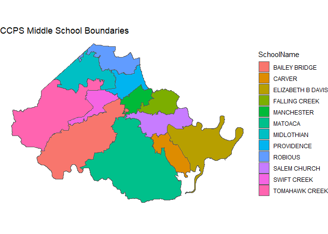
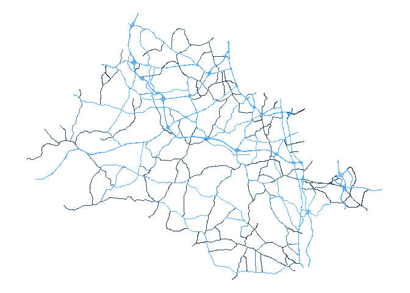

<!-- README.md is generated from README.Rmd. Please edit that file -->

# chestergeo

<!-- badges: start -->

[](https://github.com/ccps-research-eval/chestergeo/actions/workflows/check-release.yaml)
[](https://github.com/ccps-research-eval/chestergeo/actions/workflows/test-coverage.yaml/)
[](https://app.codecov.io/gh/ccps-research-eval/chestergeo?branch=master)

<!-- badges: end -->

`{chestergeo}` provides an interface for accessing data from
[Chesterfield County’s
OpenGeoSpace](https://opengeospace.chesterfield.gov/). This includes
publicly-available data describing county infrastructure, school and
voting boundaries, utility locations, and locations of police/fire/EMS
responses, among others.

## Installation

You can install the development version of chestergeo from
[GitHub](https://github.com/) with:

``` r
# install.packages("devtools")
devtools::install_github("ccps-research-eval/chestergeo")
```

## Basic Usage

The core function provided by the package is `get_geo_data()`. This
function takes a “layer” argument, which defines the OpenGeoSpace layer
to retrieve data from. You can see all layers available in the
`available_layers` object (as well as within the `layers_crosswalk`
data).

For example, we might be interested in retrieving the middle school
boundary data:

``` r
library(chestergeo)

ms_bounds <- get_geo_data("MiddleSchoolBoundary")
#> Reading layer `OGRGeoJSON' from data source 
#>   `https://services3.arcgis.com/TsynfzBSE6sXfoLq/ArcGIS/rest/services/Administrative/FeatureServer/10/query?outFields=*&where=1%3D1&f=geojson' 
#>   using driver `GeoJSON'
#> Simple feature collection with 12 features and 6 fields
#> Geometry type: MULTIPOLYGON
#> Dimension:     XY
#> Bounding box:  xmin: -77.87853 ymin: 37.21675 xmax: -77.24623 ymax: 37.56251
#> Geodetic CRS:  WGS 84
```

This returns an `sf` object:

``` r
library(dplyr)

glimpse(ms_bounds)
#> Rows: 12
#> Columns: 7
#> $ OBJECTID      <int> 1, 2, 3, 4, 5, 6, 7, 8, 9, 10, 11, 12
#> $ SchoolName    <chr> "TOMAHAWK CREEK", "SWIFT CREEK", "BAILEY BRIDGE", "SALEM…
#> $ GlobalID      <chr> "290269f3-e95a-4ebe-99cf-760164f045fb", "01631492-2647-4…
#> $ SchoolNum     <int> 88, 27, 63, 72, 87, 11, 42, 76, 32, 69, 67, 25
#> $ Shape__Area   <dbl> 292504601, 56397332, 291974043, 96218314, 186982820, 427…
#> $ Shape__Length <dbl> 115768.99, 56764.60, 120664.61, 71727.80, 112616.58, 128…
#> $ geometry      <MULTIPOLYGON [°]> MULTIPOLYGON (((-77.64379 3..., MULTIPOLYGON (((-77.6221…
```

We can then plot this object just as we would any other `sf` object.

``` r
library(ggplot2)

ggplot(ms_bounds) +
  geom_sf(aes(fill = SchoolName)) +
  labs(title = "CCPS Middle School Boundaries") +
  theme_void()
```



Likewise, if we wanted to see the major roads in the county:

``` r
roads <- get_geo_data("Major Roads")
#> Reading layer `OGRGeoJSON' from data source 
#>   `https://services3.arcgis.com/TsynfzBSE6sXfoLq/ArcGIS/rest/services/Transportation/FeatureServer/6/query?outFields=*&where=1%3D1&f=geojson' 
#>   using driver `GeoJSON'
#> Simple feature collection with 208 features and 16 fields
#> Geometry type: MULTILINESTRING
#> Dimension:     XY
#> Bounding box:  xmin: -77.86565 ymin: 37.22161 xmax: -77.27139 ymax: 37.57515
#> Geodetic CRS:  WGS 84

ggplot(roads) +
  geom_sf(aes(color = OBJECTID)) +
  theme_void() +
  theme(
    legend.position = "none"
  )
```



## Wrapping Functions

I am currently implementing some functions that wrap the
`get_geo_data()` function so that users do not necessarily need to know
the names of the layers they’re accessing (which names aren’t always
super straightforward). Currently, the only wrapper function is
`get_school_boundaries()`, which allows users to request school boundary
lines.

The following code chunks do the same thing:

``` r
ms_bounds <- get_geo_data("MiddleSchoolBoundary")

#same as
ms_bounds2 <- get_school_boundaries(level = "middle")
```
